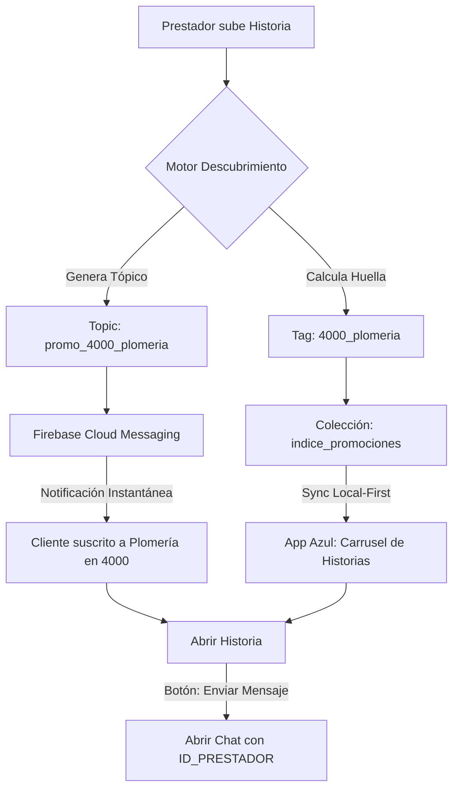

# 📱 Arquitectura de Historias Elite (Protocolo Maverick)

Este documento detalla el funcionamiento del sistema de contenido efímero (Historias) comparado con los estándares de la industria como Instagram o WhatsApp.

## 🌟 Concepto Táctico
A diferencia de Instagram, donde el contenido viaja a través de un **Grafo Social** (seguidores), en Maverick el contenido viaja a través de un **Grafo de Necesidad Local** (Zona + Rubro).

### 1. El Objeto de Publicación
Una **Historia** en Maverick es una `Promotion` con `tipo = HISTORIA`.
*   **Vida Útil**: 24 horas (cumpliendo la Ley #8).
*   **Contenido**: Soporte multi-imagen (hasta 5 fotos) y metadatos de identidad.

### 2. El Sistema de Tópicos (Footprints)
Al subir una historia, el sistema deja una **"Huella Técnica"** en Firestore y dispara un **"Pulso de Red"** (FCM):

| Nivel | Huella (Tag) | Tópico (FCM) | Alcance |
| :--- | :--- | :--- | :--- |
| **Zona** | `4000` | `zona_4000` | Todos en el área. |
| **Rubro** | `plomeria` | - | Interés general. |
| **Elite** | `4000_plomeria` | `promo_4000_plomeria` | El público objetivo exacto. |

### 3. Embebiendo Identidad (Actionable Data)
Para que el cliente pueda enviar mensajes desde la historia, el documento en Firestore **DEBE** incluir:
*   `idPrestador`: El UID de Firebase Auth.
*   `idCanalChat`: El ID de la sucursal o cuenta personal (para multiexperiencia).
*   `nombre` y `foto`: Para evitar "Shallow Hits" (consultas extra) a otras colecciones (Ley #2).

## 📊 Flujo de Datos (Instagram vs Maverick)



## ⚙️ Estructura del Documento (JSON)
```json
{
  "id": "abc-123",
  "tipo": "HISTORIA",
  "idPrestador": "uid_maverick",
  "nombrePrestador": "Maverick Informática",
  "reputacion": 4.8,
  "urlImagenes": ["https://storage.../img1.jpg"],
  "filtrosBusqueda": ["4000_plomeria", "4000", "plomeria"],
  "fechaExpiracion": 1721684400000
}
```

> [!TIP]
> Esta arquitectura nos permite que un usuario reciba una notificación de una oferta de un plomero a 5 cuadras, incluso si nunca antes lo había contactado. Es **Descubrimiento Proactivo**.
