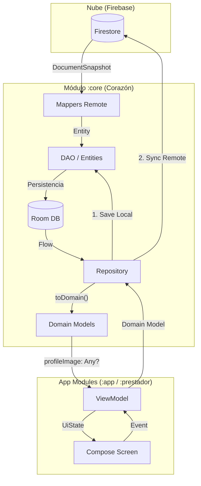

# 📘 Manual de Operaciones: Módulo compartido `:core` (v2.3)

Este módulo es el **corazón de datos e inteligencia** del ecosistema Informática Maverick. Centraliza la lógica de negocio, persistencia local (Room) y comunicación remota (Firebase) para asegurar que la App del Cliente y la App del Prestador hablen el mismo idioma bajo el estándar **Elite SSOT**.

---

## ⚖️ Leyes Fundamentales del Core (Protocolo Maverick)

Cualquier desarrollo en este módulo debe respetar estas 3 leyes inquebrantables:

1.  **Metodología "Costo Zero":** 
    *   **Persistencia Total:** Los datos **SIEMPRE** se guardan primero en Room antes de cualquier renderizado.
    *   **Lectura Local-First:** Las consultas se realizan **SIEMPRE** a Room. Firebase solo se usa para verificar actualizaciones o descargar deltas.
    *   **Mapeo Quirúrgico:** Usar los `Mappers` centralizados para transformar Documentos de la nube en Entidades de Room inmediatamente.

2.  **Carga On-Demand (Bajo Demanda) e Imágenes "Ready-to-Consume":**
    *   **Mapeo Gradual:** Los mappers procesan datos en dos niveles: *Tarjeta* (mínimo visual) y *Detalle* (pesado).
    *   **Procesamiento Centralizado de Imágenes:** La UI **nunca** debe decidir si una imagen es URL o Base64. El Core (vía `toDomain()`) procesa los `photoUrl` y entrega objetos `profileImage: Any?` listos para `AsyncImage`.
    *   La sincronización con la nube se dispara solo por eventos (Push) o acceso a secciones específicas.

3.  **SSOT (Single Source of Truth):**
    *   El módulo `:core` es la única fuente de verdad. 
    *   Si un dato cambia, debe cambiar en `:core` para que ambas apps se actualicen automáticamente.

---

## 🏗️ Arquitectura de Trabajo

El flujo de datos sigue el esquema de **Director, Mediador y Obreros**:

*   **Los Obreros (ViewModels de Pantalla):** Transforman datos de Room en `UiState` consumiendo los repositorios de `:core`.
*   **Pantallas Tontas (Stateless Screens):** La UI no piensa. Solo refleja el estado enviado por el Obrero.
*   **Mappers Centralizados (`data/remote/`):** Traductores universales. Convierten Firestore a Entidades de Room.

---

## 🔄 Flujo de Datos Maestro (Elite SSOT)

El ecosistema Maverick opera bajo un flujo unidireccional y reactivo. La persistencia en Room es el eje central de toda la operación.

### 🗺️ Mapa de Relaciones

### 🧱 Responsabilidades por Capa

1.  **Entity (`data/local/entity/`)**: Define la estructura de Room.
2.  **DAO (`data/local/dao/`)**: Contratos de acceso reactivo (`Flow`).
3.  **Mapper (`data/remote/`)**: Traduce JSON de Firestore a `Entities`.
4.  **Repository (`data/repository/`)**: 
    *   **Lectura:** Expone datos de Room transformados a **Modelos de Dominio**.
    *   **Conversión Táctica:** Invoca `toDomain()` en las entidades para procesar imágenes (Base64 -> ByteArray) y metadatos.
5.  **ViewModel (`presentation/`)**: Consume el `Repository`. Mantiene el `UiState`.
6.  **Screen (`presentation/ui/`)**: Refleja el `UiState`. Usa `AsyncImage(model = domain.profileImage)`.

---

## 📂 Estructura del Módulo

1.  **`domain/model/`**: Modelos de Dominio (`User`, `CompanyClient`, etc.). Poseen los campos `profileImage: Any?`.
2.  **`data/local/entity/`**: Entidades de Room. Contienen la función `toDomain()` que centraliza el procesamiento visual.
3.  **`data/remote/`**: Mappers que manejan la jerarquía Firestore -> Room.
4.  **`utils/`**: Utilidades compartidas (`ImageUtils`, `MaverickGeoUtils`).

---

## 🌐 Infraestructura de APIs y Utilidades Centralizadas (v2.2)

1.  **`data/remote/api/`**: Interfaces Retrofit compartidas.
2.  **`utils/MaverickGeoUtils`**: Consistencia geográfica (Haversine, CPA Premium, Normalización).

### 📝 Guía de Implementación para Prestadores (v2.3):
Para sincronizarte con el estándar Premium y evitar imágenes rotas o lógica duplicada:
1.  **Consumo de Imágenes:** En tus ViewModels/Screens, asegúrate de usar los **Modelos de Dominio** (ej: `User`) obtenidos del repositorio. No uses `UserEntity` directamente en la UI.
2.  **Atributo `profileImage`:** Utiliza siempre el atributo `profileImage` (o `photoImage`) de tipo `Any?`. Pásalo directamente al `model` de `AsyncImage`. El Core ya se encargó de decodificar el Base64 si era necesario.
3.  **Geocodificación:** Usa `MaverickGeoUtils` para asegurar el formato CPA legal (Letra + 4 dígitos).

---

## 🚦 Reglas de Oro para Desarrolladores

### 1. Prohibido código de UI
`:core` es puramente lógico. Sin imports de `Compose`.

### 2. Uso de Mappers y toDomain()
Es obligatorio usar `toDomain()` para pasar de la base de datos a la UI. Esta función es la que "limpia" y "prepara" los datos (imágenes, cálculos de nombres, etc.).

### 3. Optimización Multimedia
Usa `ImageUtils.processImageSource` dentro de `toDomain()` para procesar cualquier String que provenga de la nube o base de datos local antes de enviarlo a la UI.

---

**Mantenido por el Equipo de Informática Maverick**
