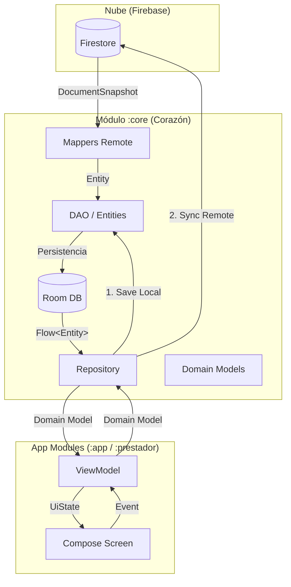

# 📘 Manual de Operaciones: Módulo compartido `:core` (v2.1)

Este módulo es el **corazón de datos e inteligencia** del ecosistema Informática Maverick. Centraliza la lógica de negocio, persistencia local (Room) y comunicación remota (Firebase) para asegurar que la App del Cliente y la App del Prestador hablen el mismo idioma bajo el estándar **Elite SSOT**.

---

## ⚖️ Leyes Fundamentales del Core (Protocolo Maverick)

Cualquier desarrollo en este módulo debe respetar estas 3 leyes inquebrantables:

1.  **Metodología "Costo Zero":** 
    *   **Persistencia Total:** Los datos **SIEMPRE** se guardan primero en Room antes de cualquier renderizado.
    *   **Lectura Local-First:** Las consultas se realizan **SIEMPRE** a Room. Firebase solo se usa para verificar actualizaciones o descargar deltas.
    *   **Mapeo Quirúrgico:** Usar los `Mappers` centralizados para transformar Documentos de la nube en Entidades de Room inmediatamente.

2.  **Carga On-Demand (Bajo Demanda):**
    *   **Mapeo Gradual:** Los mappers están diseñados para procesar datos en dos niveles:
        *   *Nivel Tarjeta:* Extrae solo campos visuales mínimos (`title`, `photo`, `rating`) para listas masivas.
        *   *Nivel Detalle:* Procesa subcolecciones y metadatos pesados (`branches`, `items`, `gallery`) solo cuando el usuario entra a una vista específica.
    *   La sincronización con la nube se dispara solo por eventos (Push) o cuando el usuario entra a una sección específica.

3.  **SSOT (Single Source of Truth):**
    *   El módulo `:core` es la única fuente de verdad. 
    *   Si un dato cambia (ej: Estado de un presupuesto), debe cambiar en `:core` para que ambas apps se actualicen automáticamente.

---

## 🏗️ Arquitectura de Trabajo

El flujo de datos sigue el esquema de **Director, Mediador y Obreros**:

*   **Los Obreros (ViewModels de Pantalla):** Responsables del "trabajo sucio". Transforman datos de Room en `UiState`. No acceden a Firebase directamente; usan los repositorios de `:core`.
*   **Pantallas Tontas (Stateless Screens):** La UI no piensa. Solo refleja el estado enviado por el Obrero y emite eventos hacia el ViewModel.
*   **Mappers Centralizados (`data/remote/`):** Traductores universales. Convierten JSON/Firestore a Entidades de Room asegurando consistencia matemática y de tipos.

---

## 🔄 Flujo de Datos Maestro (Elite SSOT)

El ecosistema Maverick opera bajo un flujo unidireccional y reactivo. La persistencia en Room es el eje central de toda la operación.

### 🗺️ Mapa de Relaciones

### 🧱 Responsabilidades por Capa

1.  **Entity (`data/local/entity/`)**: Define la estructura de la tabla en Room. Es el espejo de los datos persistidos.
2.  **DAO (`data/local/dao/`)**: Contratos de acceso a datos. Proporciona `Flows` para reactividad en tiempo real.
3.  **Mapper (`data/remote/`)**: Traduce la anarquía del JSON de Firestore al orden de las `Entities`. Es el guardián de la integridad de tipos.
4.  **Repository (`data/repository/`)**: 
    *   **Lectura:** Expone datos de Room transformados a Modelos de Dominio.
    *   **Escritura:** Aplica la ley de "Costo Zero": guarda en Room inmediatamente y dispara la sincronización en segundo plano hacia Firestore.
5.  **ViewModel (`presentation/`)**: Consume el `Repository`. Mantiene el `UiState` y maneja la lógica de navegación/eventos. No conoce la existencia de Firebase.
6.  **Screen (`presentation/ui/`)**: Refleja el `UiState`. Es 100% agnóstica de dónde vienen los datos.

---

## 📂 Estructura del Módulo

1.  **`domain/model/`**: Data Classes puras. El lenguaje común del ecosistema.
2.  **`data/local/`**: Gestión de Room (`Entity` y `DAO`). Aquí se define la estructura de las tablas.
3.  **`data/remote/`**: 
    *   **Mappers:** (`UserDataMapper`, `BudgetDataMapper`, `ChatMessageMapper`). 
        *   Implementan lógica de **Auto-Decodificación Multimedia** (Base64 -> Local File).
        *   Soportan **Side-Effect Sync**: El chat dispara actualizaciones en Presupuestos y Agenda automáticamente.
4.  **`data/repository/`**: El cerebro de decisión. Implementa la lógica **Offline-First**. 
    *   Sectorizado por responsabilidades: Común, Cliente y Prestador.
5.  **`utils/`**: Manuales de procedimientos y utilidades compartidas (Imagen, Ubicación, String).

---

## 🌐 Infraestructura de APIs y Utilidades Centralizadas (v2.2)

Para evitar la anarquía de cálculos en las aplicaciones, el `:core` ahora centraliza:

1.  **`data/remote/api/`**: Contiene las interfaces de Retrofit para servicios externos compartidos (Clima, Geocodificación, etc.).
2.  **`utils/MaverickGeoUtils`**: El "Manual de Procedimientos Geográficos". Todas las apps DEBEN usar este objeto para asegurar consistencia en:
    *   Cálculos de distancia (Haversine).
    *   Estimación de tiempos de llegada.
    *   Normalización de coordenadas.
    *   **Normalización CPA Premium:** Traduce códigos postales numéricos al formato legal (Ej: "4000" -> "T4000").
    *   **Interoperabilidad:** Uso de `clientToProvider()` y `providerToClient()` para compartir ubicaciones vía Chat sin pérdida de datos.

### 📝 Guía de Implementación para Prestadores (v2.2):
Si eres el encargado de la App del Prestador, sigue estos pasos para sincronizarte con el estándar Premium:
1.  **Geocodificación:** Reemplaza cualquier uso de `Geocoder` manual por `MaverickGeoUtils.getAddressFromCoordinates()`. Esto garantiza que guardes el `codigoPostal` en formato CPA (Letra + 4 dígitos).
2.  **Perfil de Empresa:** Al guardar sucursales, asegúrate de persistir la `latitude` y `longitude` obtenidas del Utils. El cliente las usará para el Radar FAST.
3.  **Chat:** Si recibes una ubicación del cliente, usa `MaverickGeoUtils.clientToProvider(address)` antes de intentar guardarla en la base de datos del prestador.

---

## 🚦 Reglas de Oro para Desarrolladores

### 1. Prohibido código de UI
Ningún archivo en `:core` debe importar librerías de `Compose` o `View`. Este módulo es puramente lógico.

### 2. Uso de Mappers
Nunca uses `toObject(User::class.java)` de Firebase. Utiliza los mappers centralizados para garantizar que los campos anidados (`perfil`, `empresas`, etc.) se procesen correctamente y se guarden en Room siguiendo la jerarquía SSOT.

### 3. Optimización Multimedia
Toda imagen o audio debe pasar por `ImageUtils.compressImageToWebP` antes de ser enviada. Los mappers se encargan de decodificar Base64 recibidos y persistirlos en `maverick_media` para ahorrar ancho de banda.

---

## 🛠️ Cómo agregar una nueva entidad compartida
1.  Define el modelo en `domain/model`.
2.  Crea la `Entity` y el `DAO` en `data/local`.
3.  **Crea su Mapper** en `data/remote` manejando los niveles de carga (Tarjeta vs Detalle).
4.  Expón la funcionalidad mediante un `Repository` sectorizado e inyectable vía Hilt.

---

**Mantenido por el Equipo de Informática Maverick**
