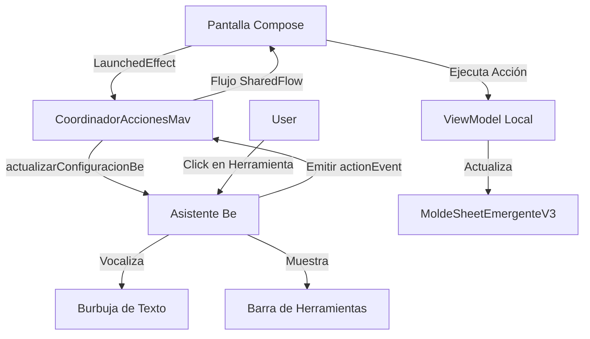

# 🛡️ Protocolo Maverick Elite: Anatomía de Pantallas (v2026.FINAL)

Este protocolo define el estándar técnico obligatorio para la construcción y modificación de pantallas. Se basa en la **Soberanía de Pantalla**, donde el Asistente Be y el HUD actúan como voceros del contexto dictado por la propia vista.

---

## 🏛️ 1. LA ESTRUCTURA DE 4 CAPAS (EL "CUATRO OJOS")

Cada pantalla debe orquestar estas capas de forma jerárquica:

### A. Cabecera Soberana (`BarraCabezera.kt`)
*   **Archivo**: `ui/componentes/BarraCabezera.kt`
*   **Función**: Identificación visual inmediata.
*   **Parámetros Críticos**:
    *   `title`: Nombre de la pantalla.
    *   `emoji`: Símbolo representativo (ej: "💬", "💰").
    *   `accentColor`: Color dominante de la pantalla (ej: `MaverickColors.ElectricCyan`).
    *   `collapseFraction`: Proporcionado por el estado de scroll de la lista inferior.

### B. Tarjeta de Contexto e Identidad (`MoldeTarjetaPerfilDirec.kt`)
*   **Archivo**: `ui/componentes/sistema/contexto/MoldeTarjetaPerfilDirec.kt`
*   **Obreros (ViewModels)**:
    *   **Identidad**: `ArmadorUsuarioViewModel` -> Provee `nombrePerfilActivo` y `fotoPerfilActiva`.
    *   **Ubicación**: `UbicacionObrero` -> Provee `direccionActiva` y gestiona `seleccionarDireccion(id)`.
*   **Barra de Filtros**: Debe usar `BarraFiltrosEliteV3.kt`.
    *   **Lógica**: La pantalla provee la lista de `DropdownItemData` y el ViewModel local procesa el evento `onFilterToggle(id)`.

### C. Contenedor de Resultados (`MoldeSheetEmergenteV3.kt`)
*   **Archivo**: `ui/componentes/sistema/lista/MoldeSheetEmergenteV3.kt`
*   **REGLA DE ORO**: Reemplaza a `ListaMoldeV2` y `ListaGridMoldeV2`.
*   **Implementación**:
    *   Para contenido principal persistente: `estaVisible = true`.
    *   Para contenido bajo demanda: Vinculado a un booleano del ViewModel local.
*   **Contenido Interno**: Se inyecta una `LazyColumn` o `LazyVerticalGrid` dentro del bloque de `contenido`.

### D. Vocero Asistente (HUD Be - Modo Portavoz)
*   **Archivo Orquestador**: `coordinadores/CoordinadorNavegacion.kt`
*   **Lógica de "Mapa de Soberanía"**: La interfaz se controla mediante un registro reactivo. Cada pantalla "anota" sus necesidades en el mapa.
*   **Funciones Obligatorias en `DisposableEffect(Unit)`**:
    1.  `navCoordinador.registrarPantalla(beConfig)`: Registra el contrato visual de la pantalla activa.
    2.  `onDispose { navCoordinador.removerPantalla(beConfig.id) }`: Remueve el registro, devolviendo el control a la pantalla anterior.
*   **Configuración Base (`beConfig`)**:
    *   `mostrarBe`: Visibilidad del asistente.
    *   `mostrarBarraNavegacion`: Visibilidad de la barra inferior.
    *   `primarias`: Herramientas del HUD.
*   **Soberanía de Limpieza**: El uso de `DisposableEffect` garantiza higiene total al navegar, eliminando redundancias en el ruteo.

---

## 🔄 2. FLUJO DE DATOS "ELITE PIPELINE"

---

## 🗑️ 3. DICCIONARIO DE SANEAMIENTO (ELIMINACIÓN RADICAL)

| Archivo Obsoleto | Reemplazo Elite v2026 |
| :--- | :--- |
| `TarjetasFiltrosV3.kt` | `sistema/contexto/MoldeTarjetaPerfilDirec.kt` |
| `ListaElementosMoldeV2.kt` | `sistema/lista/MoldeSheetEmergenteV3.kt` |
| `ListaGridMoldeV2.kt` | `sistema/lista/MoldeSheetEmergenteV3.kt` |
| Búsqueda interna en VM | Observar `coordinador.consultaBusquedaNormalizada` |

---

## 🧪 4. REGLAS DE "GRANDES LIGAS"

1.  **Costo Zero (Ley #2)**: No calcules identidades en la pantalla. Pídeselas al `ArmadorUsuarioViewModel`.
2.  **Stateless UI (Ley #1)**: Si la pantalla tiene más de 3 estados internos, créale un `ScreenState` (Data Class) en el ViewModel.
3.  **Idioma Maverick**: Se prohíbe el inglés en lógica de negocio. `fetchData` -> `cargarDatos`. `searchQuery` -> `consultaBusqueda`.
4.  **Estratificación Atómica**: Todo nuevo componente debe seguir el [Protocolo de Estratificación Atómica V3](file:///D:/StudioProjects/ProyectosApps/informaticamaverick-App-PBEN2.8.1/core/PROTOCOLO_ESTRATIFICACION_ATOMICA_V3.md).

---
**Informática Maverick - Departamento de Arquitectura de Software (2026)**
